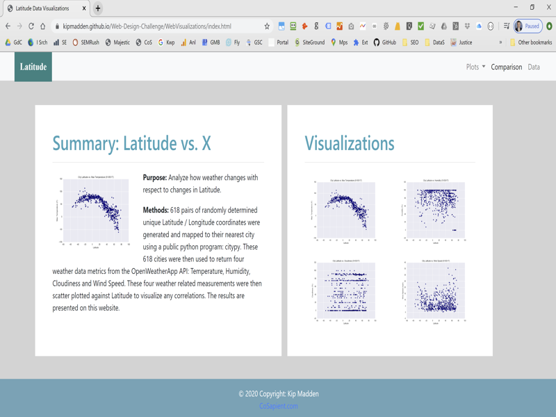
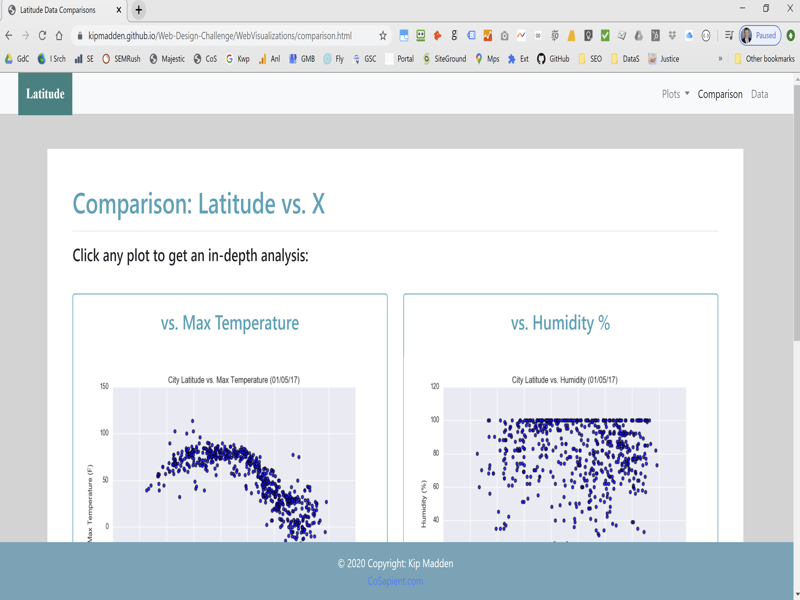
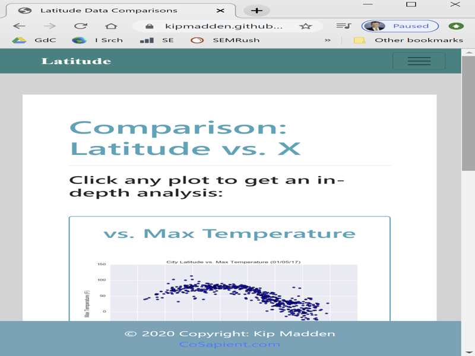
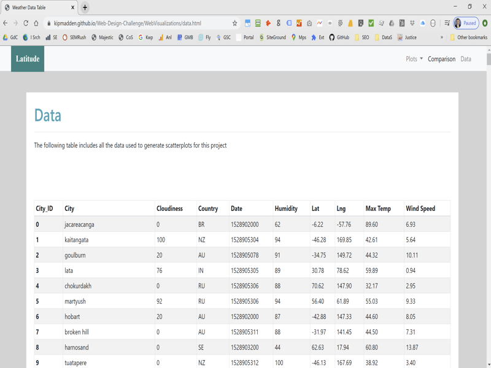
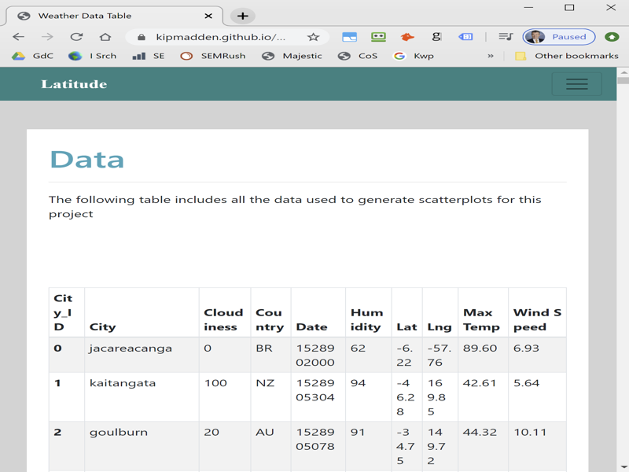
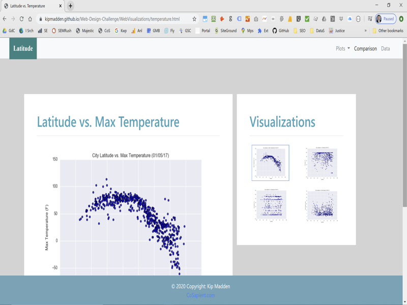
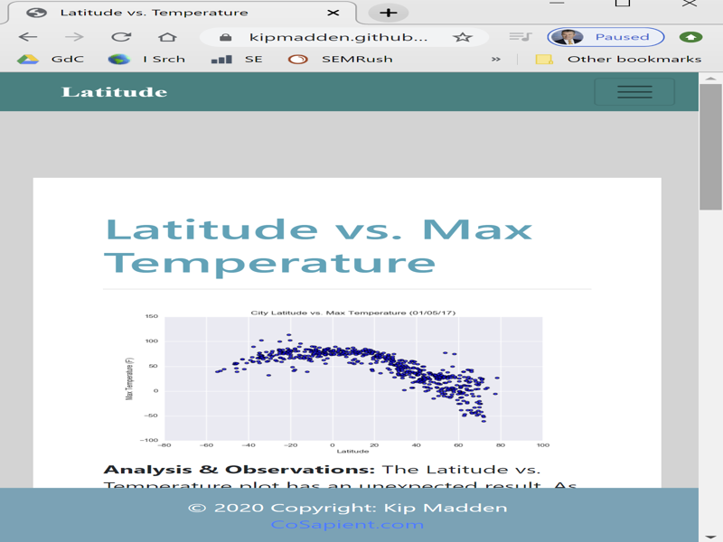
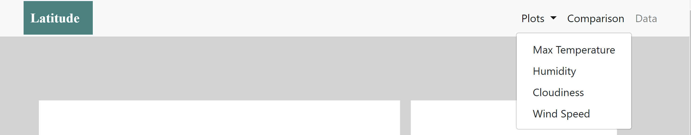
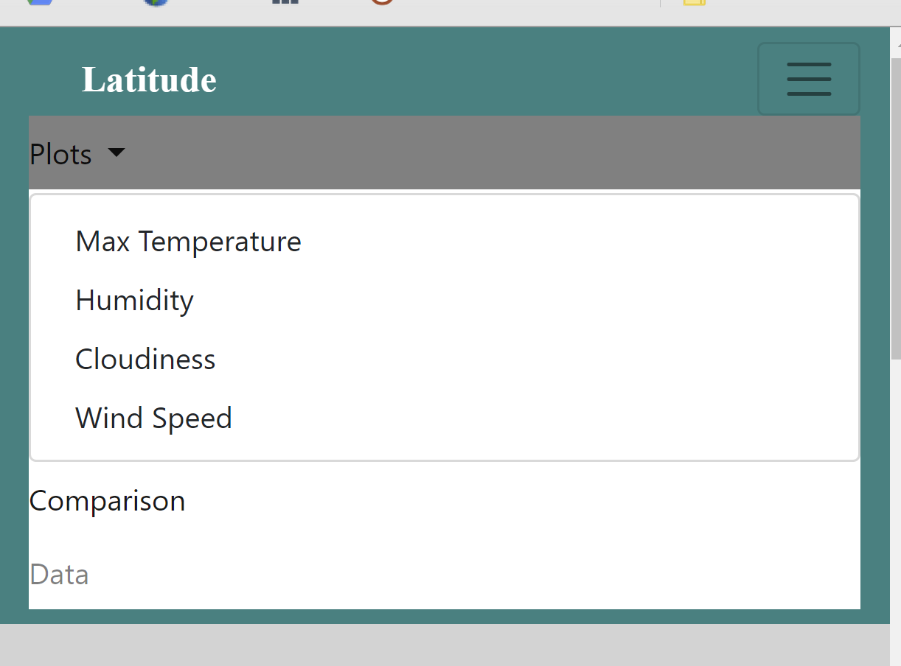

# Web Design Homework - Web Visualization Dashboard (Latitude)

## Background

This repository seeks to create a website using `HTML` and `CSS` primarily from `Bootstrap` code snippets. A prior data analysis `WeatherPy` will be used as the data to create a website "Dashboard" to demonstrate the power of being able share and communicate your data science results publicly on a website. The website will be deployed on GitHub pages as the host of the `.html` files.

## Latitude - Latitude Analysis Dashboard with Attitude

For this exercise we'll be using [weather data](WebVisualizations/Resources/cities.csv) and using scatterplots from the [WeatherPy repository](https://github.com/kipmadden/python-api-challenge).

Individual pages for each plot and a means by which we can navigate between them. These pages will contain the visualizations and their corresponding explanations. We'll also have a landing page, a page where we can see a comparison of all of the plots, and another page where we can view the data used to build them.

### Website Pages

For reference, see the ["Screenshots" section](#screenshots) below.

The website consists of 7 pages total:

* A [landing page](#landing-page) containing:
  * An explanation of the project.
  * Links to each visualizations page.
* Four [visualization pages](#visualization-pages), each with:
  * A descriptive title and heading tag.
  * The plot/visualization itself for the selected comparison.
  * A paragraph describing the plot and its significance.
* A ["Comparisons" page](#comparisons-page) that:
  * Contains all of the visualizations on the same page so we can easily visually compare them.
  * Uses a bootstrap grid for the visualizations.
* A ["Data" page](#data-page) that:
  * Displays a responsive table containing the data used in the visualizations.
    
The website has at the top of every page a navigation menu that:

* Has the name of the site on the left of the nav which allows users to return to the landing page from any page.
* Contains a dropdown on the right of the navbar named "Plots" which provides links to each individual visualization page.
* Provides two more links on the right: "Comparisons" which links to the comparisons page, and "Data" which links to the data page.
* Is responsive (using media queries). The nav must have similar behavior as the screenshots ["Navigation Menu" section](#navigation-menu) (notice the background color change).

### Screenshots

This section contains screenshots of each page at varying screen widths.

#### Landing page

Large screen:

Small screen:



#### Comparisons page

Large screen:

Small screen:

#### Data page

Large screen:

Small screen:

#### Visualization pages

You'll build four of these, one for each visualization. Here's an example of one:

Large screen:

Small screen:

#### Navigation menu

Large screen:

Small screen:

